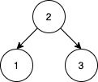
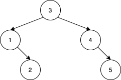
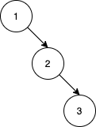

# 1569. Number of Ways to Reorder Array to Get Same BST

[Problem link](https://leetcode.com/problems/number-of-ways-to-reorder-array-to-get-same-bst/)

## Problem statement

Given an array `nums` that represents a permutation of integers from `1` to `n`. We are going to construct a binary search tree (BST) by inserting the elements of `nums` in order into an initially empty BST. Find the number of different ways to reorder `nums` so that the constructed BST is identical to that formed from the original array `nums`.

> For example, given `nums = [2,1,3]`, we will have 2 as the root, 1 as a left child, and 3 as a right child. The array `[2,3,1]` also yields the same BST but `[3,2,1]` yields a different BST.

Return _the number of ways to reorder_ `nums` _such that the BST formed is identical to the original BST formed from_ `nums`.

Since the answer may be very large, **return it modulo** `10^9 + 7`.

**Example 1:**



```
Input: nums = [2,1,3]
Output: 1
Explanation: We can reorder nums to be [2,3,1] which will yield the same BST. There are no other ways to reorder nums which will yield the same BST.
```

**Example 2:**



```
Input: nums = [3,4,5,1,2]
Output: 5
Explanation: The following 5 arrays will yield the same BST:
[3,1,2,4,5]
[3,1,4,2,5]
[3,1,4,5,2]
[3,4,1,2,5]
[3,4,1,5,2]
```

**Example 3:**



```
Input: nums = [1,2,3]
Output: 0
Explanation: There are no other orderings of nums that will yield the same BST.
```

**Constrains:**

- `1 <= nums.length <= 1000`
- `1 <= nums[i] <= nums.length`
- All integers in `nums` are **distinct**.

## Solution

### Idea

The idea is to use the fact that the number of ways to construct a BST is the same as the number of ways to construct a BST with the same structure but with different values.

### Complexity

- Time: O(n^2)
- Space: O(n^2)

### Algorithm

Pseudo code:

```text
function count(nums):
    if nums is empty:
        return 1
    root = nums[0]
    left = [x in nums if x < root]
    right = [x in nums if x > root]
    return count(left) * count(right) * C(len(left) + len(right), len(left))

function C(n, k):
    return n! / (k! * (n - k)!)

function numOfWays(nums):
    return count(nums) - 1
```
