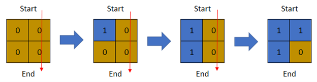
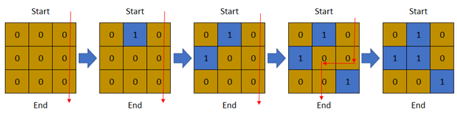

# 1970. Last Day Where You Can Still Cross

[Problem link](https://leetcode.com/problems/last-day-where-you-can-still-cross/)

## Problem statement

There is a **1-based** binary matrix where `0` represents land and `1` represents water. You are given integers `row` and `col` representing the number of rows and columns in the matrix, respectively.

Initially on day `0`, the **entire** matrix is **land**. However, each day a new cell becomes flooded with **water**. You are given a **1-based** 2D array `cells`, where `cells[i] = [ri, ci]` represents that on the `ith` day, the cell on the `ri`th row and `ci`th column (1-based coordinates) will be covered with water (i.e., changed to `1`).

You want to find the **last** day that it is possible to walk **from the top to the bottom** by only walking on land cells. You can start from **any** cell in the top row and end at **any** cell in the bottom row. You can only travel in the four cardinal directions (left, right, up, and down).

Return _the **last** day where it is possible to walk from the **top** to the **bottom** by only walking on land cells_.

### Example 1:



```
Input: row = 2, col = 2, cells = [[1,1],[2,1],[1,2],[2,2]]
Output: 2
Explanation: The above image depicts how the matrix changes each day starting from day 0.
The last day where it is possible to cross from top to bottom is on day 2.
```

### Example 2:


```
Input: row = 2, col = 2, cells = [[1,1],[1,2],[2,1],[2,2]]
Output: 1
Explanation: The above image depicts how the matrix changes each day starting from day 0.
The last day where it is possible to cross from top to bottom is on day 1.
```

### Example 3:



```
Input: row = 3, col = 3, cells = [[1,2],[2,1],[3,3],[2,2],[1,1],[1,3],[2,3],[3,2],[3,1]]
Output: 3
Explanation: The above image depicts how the matrix changes each day starting from day 0.
The last day where it is possible to cross from top to bottom is on day 3.
```

### Constraints:

- `2 <= row, col <= 2 * 10^4`
- `4 <= row * col <= 2 * 10^4`
- `cells.length == row * col`
- `1 <= ri <= row`
- `1 <= ci <= col`
- All the values of `cells` are **unique**.

## Solution explanation

The problem is a bit tricky to understand, but it's actually a simple binary search problem.

The idea is to find the last day where it's possible to cross from top to bottom. This means that we can cross from top to bottom on day `d`, but we can't cross on day `d + 1`. This means that on day `d + 1`, there is no path from top to bottom.

We can use binary search to find the last day where we can cross. We can use a `visited` matrix to keep track of the cells that are flooded. We can use a `queue` to keep track of the cells that are flooded on the current day. We can use a `directions` array to keep track of the directions we can move in.

We can start by flooding all the cells in `cells` on day `0`. Then, we can flood all the cells in `queue` on day `1`. We can continue this process until we can't flood any more cells. If we can't flood any more cells, then we know that there is no path from top to bottom on day `d + 1`, so we can return `d`.

## Complexity analysis

- Time complexity: O(n log n) where n is the number of cells in the matrix.
- Space complexity: O(n) where n is the number of cells in the matrix.

## Code

```java
public int latestDayToCross(int row, int col, int[][] cells) {
    int[][] directions = {{0, 1}, {0, -1}, {1, 0}, {-1, 0}};
    int[][] visited = new int[row][col];
    int left = 0;
    int right = cells.length - 1;
    while (left <= right) {
        int mid = left + (right - left) / 2;
        Queue<int[]> queue = new LinkedList<>();
        for (int i = 0; i <= mid; i++) {
            queue.add(cells[i]);
        }
        while (!queue.isEmpty()) {
            int[] cell = queue.poll();
            int r = cell[0] - 1;
            int c = cell[1] - 1;
            if (r == row - 1) {
                return mid;
            }
            visited[r][c] = 1;
            for (int[] direction : directions) {
                int newR = r + direction[0];
                int newC = c + direction[1];
                if (newR >= 0 && newR < row && newC >= 0 && newC < col && visited[newR][newC] == 0) {
                    queue.add(new int[]{newR + 1, newC + 1});
                    visited[newR][newC] = 1;
                }
            }
        }
        left = mid + 1;
    }
    return -1;
}
```
