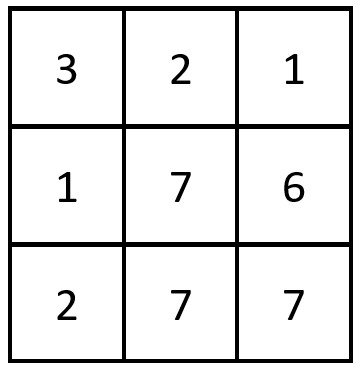
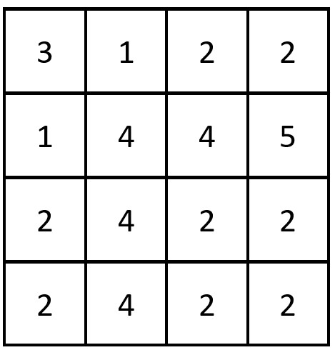

# 2352. Equal Row and Column Pairs

[Problem link](https://leetcode.com/problems/equal-row-and-column-pairs/)

## Problem statement

Given a **0-index** `n x n` integer matrix `grid`, *return the number of paris $(r_i, c_j)$ such that row $r_i$ and column $c_j$ are equal*.

A row and column pair considered equal if they contain the same elements in the same order (i.e., an equal array).

**Example 1**:



```
Input: grid = [[3,2,1],[1,7,6],[2,7,7]]
Output: 1
Explanation: There is 1 equal row and column pair:
- (Row 2, Column 1): [2, 7, 7]
```

**Example 2**:



```
Input: grid = [[3,1,2,2],[1,4,4,5],[2,4,2,2],[2,4,2,2]]
Output: 3
Explanation: There are 3 equal row and column pairs:
- (Row 0, Column 0): [3,1,2,2]
- (Row 2, Column 2): [2,4,2,2]
- (Row 3, Column 2): [2,4,2,2]
```

**Constraints**:

- `n == grid.length == grid[i].length`
- `1 <= n <= 200`
- `1 <= grid[i][j] <= 10^5`


## Solution

### Intuition

We can use a hash map to store the number of occurrences of each row and column. Then we can iterate through the hash map and count the number of pairs.

### Algorithm

1. Create an empty hash map `row_counter` and set `count` to 0.
2. For each row `row` in the grid, convert it into an equivalent hashable object and use it as a key to the `row_counter`. Increment the value of the corresponding key by 1.
3. For each column in the grid, convert it into the same type of hashable object and check if it appears in the `row_counter`. If it does, increment `count` by the frequency.
4. Return the answer `count`.

### Complexity analysis

- Time complexity: $O(n^2)$, where $n$ is the length of the matrix.
- Space complexity: $O(n^2)$, where $n$ is the length of the matrix. We store each row of the grid in the hash map, in the worst-case scenario, `row_counter` might contains nnn distinct rows of length nnn.
