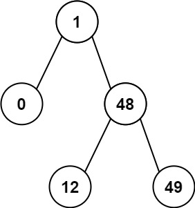

# 530. Minimum Absolute Difference in BST

[Problem link](https://leetcode.com/problems/minimum-absolute-difference-in-bst/)

## Description

Given the `root` of a Binary Search Tree (BST), return *the minimum absolute difference between the values of any two different nodes in the tree*.

**Example 1:**


```
Input: root = [4,2,6,1,3]
Output: 1
```

**Example 2:**



```
Input: root = [1,0,48,null,null,12,49]
Output: 1
```

**Constraints:**

+ The number of nodes in the tree is in the range `[2, 10^4]`.
+ `0 <= Node.val <= 10^5`

## Solution

### Solution 1: In-order Traversal

The most common idea is to first inOrder traverse the tree and compare the delta between each of the adjacent values. It's guaranteed to have the correct answer because it is a BST thus inOrder traversal values are sorted.

**Algorithm:**

```
prev = -infinity
min = +infinity

inOrder(node):
  if node == null:
      return
  inOrder(node.left)
  min = min(min, node.val - prev)
  prev = node.val
  inOrder(node.right)

inOrder(root)
return min
```

**Complexity Analysis:**

+ Time Complexity: `O(N)`, where `N` is the number of nodes in the tree. We iterate over every node once.
+ Space Complexity: `O(H)`, where `H` is the height of the tree. This is the space used by the implicit call stack when calling dfs.

### Solution 2: Morris Traversal

Morris Traversal is a way to traverse the tree without using stack and recursion. The idea is to link the predecessor of the current node to the current node when the predecessor's right subtree is null. This way we can traverse the tree without using stack and recursion.

**Algorithm:**

```
min = +infinity
predecessor = null

while root != null:
  if root.left != null:
    predecessor = root.left
    while predecessor.right != null and predecessor.right != root:
      predecessor = predecessor.right
    if predecessor.right == null:
      predecessor.right = root
      root = root.left
    else:
      predecessor.right = null
      min = min(min, root.val - predecessor.val)
      root = root.right
  else:
    min = min(min, root.val - predecessor.val)
    root = root.right

return min
```

**Complexity Analysis:**

+ Time Complexity: `O(N)`, where `N` is the number of nodes in the tree. We iterate over every node once.
+ Space Complexity: `O(1)`. We don't use any additional data structures for traversal.
