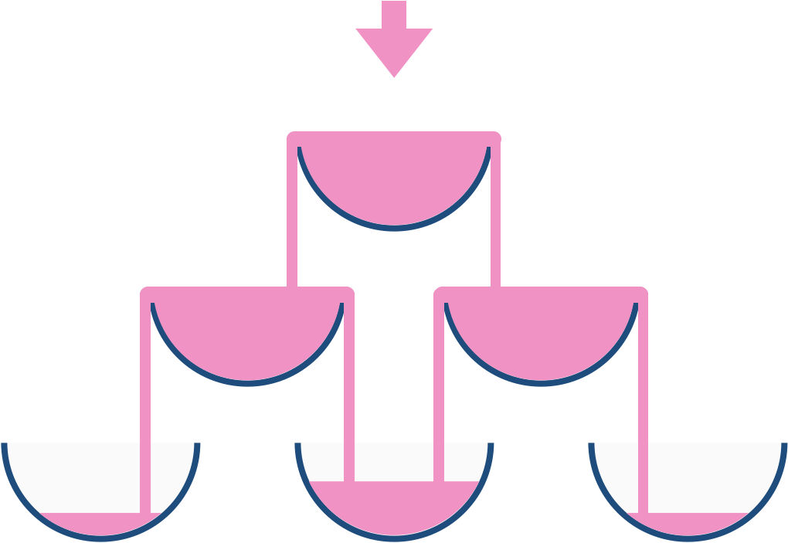

# 799. Champagne Tower

[Problem link](https://leetcode.com/problems/champagne-tower/)

## Problem statement

We stack glasses in a pyramid, where the **first** row has `1` glass, the **second** row has `2` glasses, and so on util the 100th row. Each glass holds one cup of champagne.

Then, some champagne is poured into the first glass at the top. When the top most glass is full, any excess liquid poured will fall equally to the glass immediately to the left and right of it. When those glasses become full, any excess champagne will fall equally to the left and right of those glasses, and so on. (A glass at the bottom row has it's excess champagne fall on the floor.)

For example, after one cup of champagne is poured, the top most glass is full. After two cups of champagne are poured, the two glasses on the second row are half full. After three cups of champagne are poured, those two cups become full - there are 3 full glasses total now. After four cups of champagne are poured, the third row has the middle glass half full, and the two outside glasses are a quarter full, as pictured below.

Now after pouring some non-negative integer cups of champagne, return how full the <code>jth</code> glass in the <code>ith</code> row is (both `i` and `j` are 0-indexed.)

### Example1

> **Input:** poured = 1, query_row = 1, query_glass = 1
> **Output:** 0.00000
> **Explanation:** We poured 1 cup of champagne to the top glass of the tower (which is indexed as (0, 0)). There will be no excess liquid so all the glasses under the top glass will remain empty.

### Example2

> **Input:** poured = 2, query_row = 1, query_glass = 1
> **Output:** 0.50000
> **Explanation:** We poured 2 cups of champagne to the top glass of the tower (which is indexed as (0, 0)). There is one cup of excess liquid. The glass indexed as (1, 0) and the glass indexed as (1, 1) will share the excess liquid equally, and each will get half cup of champagne.

### Example3

> **Input:** poured = 100000009, query_row = 33, query_glass = 17
> **Output:** 1.00000

### Constraints

- <code>0 &lt;= poured &lt;= 109</code>
- `0 <= query_glass <= query_row < 100`

## 1st trial

### Intuition

- The amount of champagne in the glass is the sum of the amount of champagne poured into the glass and the amount of champagne that fell from the glass above.

Dynamic programming is used to calculate the amount of champagne in each glass.

### Algorithm

1. Initialize a 2D array `dp` with the size of `query_row+1` x `query_row+1` and fill the array with 0.
2. Pour the champagne into the top glass, `dp[0][0] = poured`.
3. For each row, for each glass, calculate the amount of champagne in the glass by adding the amount of champagne poured into the glass and the amount of champagne that fell from the glass above.
4. Return the amount of champagne in the glass `dp[query_row][query_glass]`.
